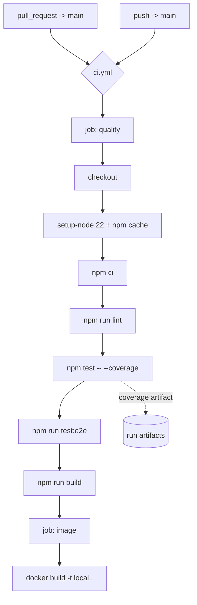

# CI Pipeline Design

**Spec**: `.specs/features/ci-pipeline/spec.md`
**Status**: Draft

---

## Architecture Overview

A single workflow file drives the whole gate. One job runs the repository's existing quality commands in the order a developer would run them locally; a second job builds the container image only after the first passes. Nothing new is invented - the workflow is a remote executor for gates that already exist.

---

## Code Reuse Analysis

### Existing Components to Leverage

| Component | Location | How to Use |
| --- | --- | --- |
| Quality scripts | `package.json` | Invoke `lint`, `test`, `test:e2e`, `build` unchanged - the workflow must not redefine them |
| Lockfile | `package-lock.json` | `npm ci` installs from it, which makes the run reproducible and fails on drift |
| Container build | `Dockerfile` | Built as-is; the image job needs no separate build recipe |
| Build context exclusions | `.dockerignore` | Already excludes `._*`, so the image build is unaffected by AppleDouble sidecars |
| E2E runner config | `test/jest-e2e.json` | Invoked through `npm run test:e2e`; no CI-specific config is introduced |

### Integration Points

| System | Integration Method |
| --- | --- |
| Branch protection on `main` | The `quality` job name is the required status check. Renaming the job silently detaches the protection rule, so the name is treated as a published contract. |
| GitHub Actions cache | `actions/setup-node` with `cache: npm`, keyed on the lockfile hash |

---

## Components

### Workflow: `ci`

- **Purpose**: Run every existing quality gate on pull requests and on `main`.
- **Location**: `.github/workflows/ci.yml`
- **Interfaces**:
  - Triggers: `pull_request` targeting `main`, `push` to `main`
  - Published contract: job name `quality` (required status check), job name `image`
- **Dependencies**: `actions/checkout`, `actions/setup-node`, `actions/upload-artifact`
- **Reuses**: the `package.json` scripts and the `Dockerfile` verbatim

### Job: `quality`

- **Purpose**: Fail the check run if lint, unit tests, end-to-end tests, or build fail.
- **Location**: `.github/workflows/ci.yml`
- **Interfaces**: `runs-on: ubuntu-latest`, Node 22, `timeout-minutes: 15`
- **Dependencies**: `npm ci` against the committed lockfile
- **Reuses**: `npm run lint`, `npm test`, `npm run test:e2e`, `npm run build`

### Job: `image`

- **Purpose**: Prove the Dockerfile still builds before the change reaches `main`.
- **Location**: `.github/workflows/ci.yml`
- **Interfaces**: `needs: quality`, builds to a local tag, pushes nowhere
- **Dependencies**: the repository `Dockerfile`
- **Reuses**: `Dockerfile`, `.dockerignore`

---

## Data Models (if applicable)

Not applicable - this feature adds no runtime data.

---

## Error Handling Strategy

| Error Scenario | Handling | User Impact |
| --- | --- | --- |
| Lint reports an error or a warning | `npm run lint` exits non-zero and fails the job | The pull request check turns red at the lint step |
| A unit or e2e test fails | The step exits non-zero; later steps do not run | The failing test name is visible in the step log |
| Lockfile drifted from `package.json` | `npm ci` refuses to resolve a different tree and exits non-zero | The check fails at install with the drift named |
| Dockerfile regression | The `image` job fails after `quality` passed | The failure is isolated to the image job, so the cause is unambiguous |
| A newer commit supersedes the run | The concurrency group cancels the in-flight run | The reported status always reflects the current head |
| A job hangs | `timeout-minutes: 15` fails it | The runner is released instead of being held |

---

## Risks & Concerns

| Concern | Location (file:line) | Impact | Mitigation |
| --- | --- | --- | --- |
| No `engines` field pins the Node version, so CI and the Dockerfile can drift apart silently | `package.json` | A change to `node:22-alpine` would not be reflected in CI, and the gate would verify a runtime the image does not use | The workflow pins Node 22 explicitly and the design records the Dockerfile as the single source; adding `engines` is proposed as a follow-up, not smuggled into this slice |
| The real verification of a workflow cannot happen before it runs on the platform | `.github/workflows/ci.yml` | A workflow that is syntactically valid can still be semantically wrong, and no local gate would catch it | The final task verifies the workflow on a real pull request by injecting a failure and observing the check go red, then reverting |
| No test invokes FFmpeg yet, so the gate cannot catch a media regression that S4 will introduce | `src/processing/processing.consumer.ts:82` | Once S4 lands, a green CI run would not prove frame extraction works unless FFmpeg is available on the runner | Recorded in the spec as an explicit Out of Scope row with the S4 hand-off named, so the gap is deliberate rather than forgotten |

> Lessons note: `.specs/LESSONS.md` holds only `candidate` entries. Per the skill's rule, candidates are not loaded as guidance, so none were applied to this design.

---

## Tech Decisions (only non-obvious ones)

| Decision | Choice | Rationale |
| --- | --- | --- |
| One workflow file or several | One `ci.yml` with two jobs | The gate is a single logical unit; splitting it across files would multiply the status-check names branch protection has to track |
| Where coverage comes from | `npm test -- --coverage` in the existing unit step | Avoids a second full test run purely to produce a report |
| Whether coverage can fail the build | It cannot | No baseline exists; a threshold picked without one blocks work arbitrarily. Recorded in the spec as an Out of Scope row |
| How the image job is ordered | `needs: quality` | Building an image for a change that already failed lint wastes a runner and muddies the failure signal |
| Workflow YAML verification before push | Parse check only | `actionlint` would catch more, but installing a tool the project does not yet use is a decision for the team, not a side effect of this slice |

> **Project-level decisions:** none here set a new convention beyond the job-name contract, which is recorded above as an integration point rather than a new `AD-NNN`.
