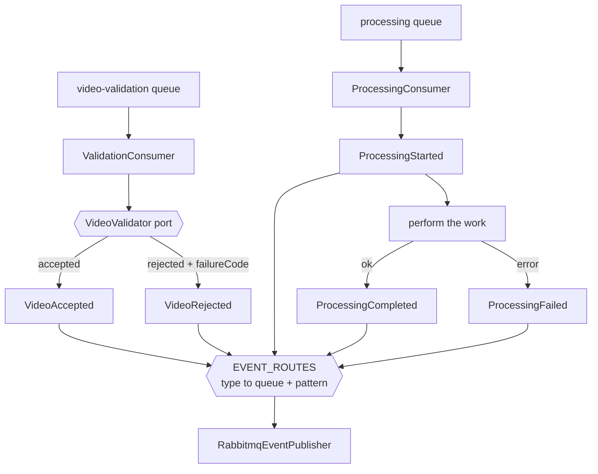

# Full Lifecycle Design

**Spec**: `.specs/features/full-lifecycle/spec.md`
**Status**: Draft

---

## Architecture Overview

Two changes, in strict order. First the publisher stops guessing what it is publishing; only then does the event vocabulary grow. Reversing that order would ship three new event types through a router that cannot tell them apart.



The `VideoValidator` port is the seam S4 fills with FFprobe. In this slice its only implementation accepts everything, which keeps the rejection path driven by a test double rather than by a fake inspection that would be thrown away.

---

## Code Reuse Analysis

### Existing Components to Leverage

| Component | Location | How to Use |
| --- | --- | --- |
| Consumer shape | `src/validation/validation.consumer.ts` | Keep the `@EventPattern` handler, the explicit `ack`, and the `requeue = !(err instanceof ...RejectedError)` policy |
| Duplicate checker | `src/validation/duplicate-checker.interface.ts` | Already guards both consumers; the new outcomes reuse it unchanged |
| Publisher port | `src/messaging/event-publisher.interface.ts` | Widen its union; the `Promise<boolean>` contract and the "false means not published" convention stay |
| Client registration | `src/messaging/messaging.module.ts` | Extend the existing `ClientsModule.register` list with three more clients, same options |
| Fake publisher | `src/messaging/fake-event-publisher.ts` | Records published events for unit tests; extend it to record the destination so routing is assertable |

### Integration Points

| System | Integration Method |
| --- | --- |
| Processing Catalog | Consumes the three new queues this slice publishes to |
| RabbitMQ | Three additional `ClientProxy` registrations, one per new destination |

---

## Components

### `EVENT_ROUTES`

- **Purpose**: Be the single place that says where an event type goes and under which pattern.
- **Location**: `src/messaging/event-routes.ts`
- **Interfaces**: `EVENT_ROUTES: Record<WorkerEventType, { client: string; pattern: string }>`
- **Dependencies**: none
- **Reuses**: the queue and pattern names already used by `messaging.module.ts`

### `RabbitmqEventPublisher` (modified)

- **Purpose**: Publish an event to the destination its declared type names.
- **Location**: `src/messaging/rabbitmq-event-publisher.ts`
- **Interfaces**: `publish(type: WorkerEventType, event: WorkerEvent): Promise<boolean>`
- **Dependencies**: one `ClientProxy` per destination, resolved through `EVENT_ROUTES`
- **Reuses**: the existing `lastValueFrom` + `catchError` shape that turns a transport error into `false`

The type moves into the call signature. That is what makes the misroute impossible rather than merely unlikely: the caller states what it is publishing instead of the publisher inferring it from a field.

### `VideoValidator` port

- **Purpose**: Decide whether a source video is acceptable, without saying how that is determined.
- **Location**: `src/validation/video-validator.interface.ts`
- **Interfaces**: `validate(job: VideoValidationRequestedDto): Promise<ValidationOutcome>` where the outcome is `{ accepted: true }` or `{ accepted: false; failureCode: FailureCode }`
- **Dependencies**: none
- **Reuses**: nothing; it is the seam S4 implements with FFprobe

### `AcceptAllVideoValidator`

- **Purpose**: Preserve today's behaviour behind the new port.
- **Location**: `src/validation/accept-all-video-validator.ts`
- **Interfaces**: implements `VideoValidator`, always accepts
- **Dependencies**: none
- **Reuses**: the behaviour currently inlined in `ValidationConsumer`

---

## Data Models

```typescript
export type WorkerEventType =
  | 'VideoAccepted'
  | 'VideoRejected'
  | 'ProcessingStarted'
  | 'ProcessingCompleted'
  | 'ProcessingFailed'

export class VideoRejectedDto {
  eventId: string
  processingRequestId: string
  failureCode: FailureCode
  occurredAt: string
}

export class ProcessingStartedDto {
  eventId: string
  processingRequestId: string
  attemptId: string
  occurredAt: string
}

export class ProcessingFailedDto {
  eventId: string
  processingRequestId: string
  attemptId: string
  failureCode: FailureCode
  occurredAt: string
}
```

**Relationships**: every event carries a fresh `eventId` for the Catalog to deduplicate on, and echoes the `processingRequestId` of the job that produced it.

---

## Error Handling Strategy

| Error Scenario | Handling | User Impact |
| --- | --- | --- |
| Job missing `processingRequestId` or `attemptId` | Rejected before any publication; nacked without requeue | No outcome is attributed to an unnamed request |
| Validator rejects the video | `VideoRejected` published with the reported code; the job is acked | The Catalog moves the request to `FAILED` |
| `ProcessingStarted` fails to publish | The work does not begin; the job is nacked | The Catalog never sees a `PROCESSING` state the Worker then abandons |
| The work itself throws | `ProcessingFailed` published with `PROCESSAMENTO_FALHOU`; the job is acked | The request becomes terminal instead of hanging in `PROCESSING` |
| Outcome publication returns `false` | Treated as a failure to publish; the job is nacked | Redelivery retries, and the duplicate checker keeps it to one business attempt |
| Redelivery after a published outcome | The duplicate checker short-circuits; nothing is published | One outcome per job |

---

## Risks & Concerns

| Concern | Location (file:line) | Impact | Mitigation |
| --- | --- | --- | --- |
| The publisher discriminates by field presence today | `src/messaging/rabbitmq-event-publisher.ts:23` and `:35` | `VideoRejected` and `ProcessingStarted` both lack `zipStorageKey` and would be published as `VideoAccepted`, corrupting the lifecycle without any error | The reason P1 exists and is sequenced first. The explicit route table is introduced and proven before any new event type is added |
| `InMemoryDuplicateChecker` does not survive a restart and is not shared between replicas | `src/validation/in-memory-duplicate-checker.ts` | Under the horizontal scaling AD-006 describes, two replicas can each publish an outcome for the same job | Out of scope here and owned by S3, which gives deduplication a durable home. Named so it is a deferral, not an oversight |
| Publishing `ProcessingStarted` before the work adds a second failure point per job | `src/processing/processing.consumer.ts` | A broker hiccup now blocks work that would previously have run | Deliberate: a `PROCESSING` state the Catalog never observes is worse than a job that retries. The nack path makes the retry safe |
| The default validator accepts everything | `src/validation/accept-all-video-validator.ts` | A green suite could be mistaken for real validation | The class name states it, and the spec's Out of Scope table names S4 as the owner of real inspection |

> Lessons note: `.specs/LESSONS.md` holds only `candidate` entries, which the skill's rule says not to load as guidance, so none were applied. `L-001` there concerns asserting that a generated identifier is well formed rather than merely different — the tasks cover this on their own terms for each new `eventId`.

---

## Tech Decisions (only non-obvious ones)

| Decision | Choice | Rationale |
| --- | --- | --- |
| How the publisher learns an event's type | The caller passes it | Any inference from payload shape breaks the moment two event types share a shape, which is already true here |
| Validation as a port now, with a permissive default | Yes | It lets the rejection path be specified and tested in this slice without pretending FFprobe exists, and S4 becomes an implementation swap rather than a rewrite |
| Failure on an unroutable event type | Throw | A default destination would deliver an event to the wrong queue and report success — the exact failure mode this story removes |
| Whether the Worker retries business failures | No | The foundation fixes one business attempt; only technical faults are retried, through nack |
| Where `FailureCode` is defined | Locally in the Worker, matching the Catalog's vocabulary | AD-003's successor keeps services free of a shared contracts package; the vocabulary is documented in `docs/foudation.md` and duplicated deliberately |

> **Project-level decisions:** none here sets a new convention beyond the route table, which is local to this service.
