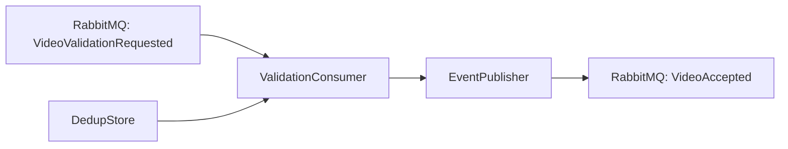

# Worker Initial Vertical Slice Design

**Spec**: `.specs/features/initial-vertical-slice/spec.md`
**Status**: Draft

---

## Architecture Overview

The first Worker slice is a controlled RabbitMQ consumer/producer path. It receives `VideoValidationRequested`, validates the payload, guards against duplicate `eventId` deliveries, and publishes `VideoAccepted`. No actual media inspection or storage happens in this slice.



---

## Code Reuse Analysis

### Existing Components to Leverage

| Component | Location | How to Use |
| --- | --- | --- |
| NestJS application bootstrap | `src/main.ts` | Extend with microservice hybrid or keep HTTP + RabbitMQ listener separate |
| AppModule | `src/app.module.ts` | Register consumer and broker providers |
| Generated Jest config | `package.json` / `test/jest-e2e.json` | Reuse for unit and e2e gates |

### Integration Points

| System | Integration Method |
| --- | --- |
| RabbitMQ | NestJS `@nestjs/microservices` RabbitMQ transport or a broker abstraction that can be faked in tests |
| Processing Catalog | Consumption of `VideoValidationRequested` and publication of `VideoAccepted` using documented JSON shapes |

---

## Components

### `ValidationConsumer`

- **Purpose**: Receives `VideoValidationRequested`, validates required fields, deduplicates by `eventId`, and delegates publication of `VideoAccepted`.
- **Location**: `src/validation/validation.consumer.ts`
- **Interfaces**:
  - `handleVideoValidationRequested(dto: VideoValidationRequestedDto): Promise<void>` — main entry point tied to the broker subscription
- **Dependencies**: `EventPublisher`, `DuplicateChecker`
- **Reuses**: NestJS `@MessagePattern` / transport consumer patterns

### `EventPublisher`

- **Purpose**: Publishes outbound events to the broker and exposes whether the publish succeeded.
- **Location**: `src/messaging/event-publisher.interface.ts` and `src/messaging/rabbitmq-event-publisher.ts`
- **Interfaces**:
  - `publish(event: VideoAcceptedDto): Promise<boolean>`
- **Dependencies**: RabbitMQ connection / client (configured in `AppModule`)
- **Reuses**: None — introduced as a local abstraction so tests can substitute an in-memory fake

### `DuplicateChecker`

- **Purpose**: Tracks seen validation `eventId`s to prevent duplicate `VideoAccepted` publications.
- **Location**: `src/validation/duplicate-checker.interface.ts` and `src/validation/in-memory-duplicate-checker.ts`
- **Interfaces**:
  - `isDuplicate(eventId: string): Promise<boolean>`
- **Dependencies**: In-memory storage for this slice
- **Reuses**: None — local interface, can be backed by Redis/distributed store in later slices

---

## Data Models

### `VideoValidationRequestedDto`

```typescript
export class VideoValidationRequestedDto {
  eventId: string;
  processingRequestId: string;
  ownerUserId: string;
  sourceStorageKey: string;
  occurredAt: string;
}
```

### `VideoAcceptedDto`

```typescript
export class VideoAcceptedDto {
  eventId: string;
  processingRequestId: string;
  occurredAt: string;
}
```

**Notes**:
- All fields are plain JSON strings. The Worker owns these local DTOs; no shared package is used.
- `VideoAcceptedDto` deliberately omits `ownerUserId` and `sourceStorageKey` because the Catalog already owns them.

---

## Error Handling Strategy

| Error Scenario | Handling | User Impact |
| --- | --- | --- |
| Missing `processingRequestId` in input | Log and throw domain error; consumer must not publish `VideoAccepted` | Catalog sees no accepted event; broker may retry the bad message depending on broker config |
| Duplicate `eventId` | Skip publish and return cleanly | No duplicate `VideoAccepted` is produced |
| Publisher failure | Propagate exception so the message is not acknowledged | Broker redelivers the same message; no new business attempt is created |

---

## Risks & Concerns

| Concern | Location | Impact | Mitigation |
| --- | --- | --- | --- |
| In-memory deduplication is not durable across restarts | `InMemoryDuplicateChecker` | A Worker restart could re-emit `VideoAccepted` for the same `eventId` | Acceptable for the first slice; later slices replace with Redis/distributed store and broker idempotent consumers |
| No real broker in unit tests | Test setup | Tests may pass but not exercise actual serialization | Add one e2e test with `Test.createTestingModule` and a fake broker channel that asserts published JSON |
| Transport choice may influence ack behavior | `ValidationConsumer` | Wrong transport config can auto-ack on failure | Document and configure `noAck: false` and only ack after successful publish |

---

## Tech Decisions

| Decision | Choice | Rationale |
| --- | --- | --- |
| Broker integration style | Port/interface + concrete RabbitMQ publisher | Lets tests run without a real broker and keeps the slice testable |
| Deduplication store | In-memory Map | Matches the slice's controlled-outcome scope; no external store needed yet |
| DTO ownership | Local classes in the Worker | Preserves the approved "documented JSON, local DTOs" contract rule |
| Ack behavior | Manual ack after successful publish | Satisfies the edge-case requirement that publish failures leave the message unacknowledged |
