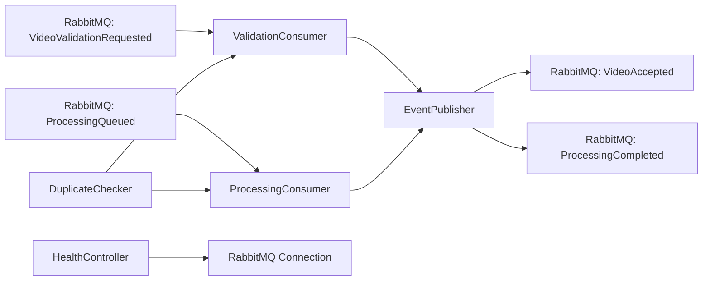

# Worker Local Docker Integration Design

**Spec**: `/Volumes/HIKSEMI/repository/fiap-x/fiapx/processing-worker/.specs/features/local-docker-integration/spec.md`
**Root contract**: `/Volumes/HIKSEMI/repository/fiap-x/fiapx/docs/foudation.md`
**Siblings**: `/Volumes/HIKSEMI/repository/fiap-x/fiapx/processing-catalog/.specs/features/local-docker-integration/spec.md`, `/Volumes/HIKSEMI/repository/fiap-x/fiapx/fiap-x-api/.specs/features/local-docker-integration/spec.md`, `/Volumes/HIKSEMI/repository/fiap-x/fiapx/notification-service/.specs/features/local-docker-integration/spec.md`
**Status**: Draft

---

## Architecture Overview

Worker becomes a real RabbitMQ consumer for two local queues. It keeps the validation path from the first slice and adds a processing path that simulates the binary result. Both consumers use manual acknowledgement: `ack` only after the follow-up event is published successfully, `nack` (without requeue) for malformed or unsupported input, and `nack` (with requeue) when publication fails. A lightweight HTTP health endpoint reports readiness only when the broker connection is up. A local Dockerfile produces the Worker container image.



---

## Code Reuse Analysis

### Existing Components to Leverage

| Component | Location | How to Use |
| --- | --- | --- |
| `ValidationConsumer` | `/Volumes/HIKSEMI/repository/fiap-x/fiapx/processing-worker/src/validation/validation.consumer.ts` | Keep validation/publish logic; wrap with manual ack decision from transport layer |
| `FakeEventPublisher` | `/Volumes/HIKSEMI/repository/fiap-x/fiapx/processing-worker/src/messaging/fake-event-publisher.ts` | Replace with RabbitMQ-backed publisher in runtime; keep fake for unit tests |
| `InMemoryDuplicateChecker` | `/Volumes/HIKSEMI/repository/fiap-x/fiapx/processing-worker/src/validation/in-memory-duplicate-checker.ts` | Reuse for local dedup; replace with distributed store later |
| `AppModule` | `/Volumes/HIKSEMI/repository/fiap-x/fiapx/processing-worker/src/app.module.ts` | Import new `MessagingModule` and `HealthModule` |
| `main.ts` | `/Volumes/HIKSEMI/repository/fiap-x/fiapx/processing-worker/src/main.ts` | Start hybrid HTTP + RabbitMQ microservice; keep `process.env.PORT ?? 3000` |
| `VideoValidationRequestedDto` / `VideoAcceptedDto` | `/Volumes/HIKSEMI/repository/fiap-x/fiapx/processing-worker/src/messaging/dto/` | Extend publisher interface to carry these plus new processing DTOs |

### Integration Points

| System | Integration Method |
| --- | --- |
| RabbitMQ | `@nestjs/microservices` RabbitMQ transport with `noAck: false`; manual `ack`/`nack` via `RmqContext` |
| Processing Catalog | Consumes `VideoValidationRequested` and `ProcessingQueued`; publishes `VideoAccepted` and `ProcessingCompleted` with documented JSON shapes |
| Health probe | HTTP `GET /health` on `PORT`; ready only when broker transport is listening |

---

## Components

### `RabbitmqEventPublisher`

- **Purpose**: Concrete `EventPublisher` that sends `VideoAccepted` and `ProcessingCompleted` JSON to the local RabbitMQ exchange/queue and returns whether the broker accepted the message.
- **Location**: `/Volumes/HIKSEMI/repository/fiap-x/fiapx/processing-worker/src/messaging/rabbitmq-event-publisher.ts`
- **Interfaces**:
  - `publish(event: VideoAcceptedDto | ProcessingCompletedDto): Promise<boolean>`
- **Dependencies**: `RMQ_CLIENT` / `ClientRMQ` or raw channel from transport
- **Reuses**: `EventPublisher` interface; extends it to accept both outbound event types

### `MessagingModule`

- **Purpose**: Configure RabbitMQ microservice transport, bind queues, and expose the real publisher.
- **Location**: `/Volumes/HIKSEMI/repository/fiap-x/fiapx/processing-worker/src/messaging/messaging.module.ts`
- **Interfaces**: none public
- **Dependencies**: environment variables `RABBITMQ_URL`, `RABBITMQ_VIDEO_VALIDATION_QUEUE`, `RABBITMQ_PROCESSING_QUEUE`, `RABBITMQ_EXCHANGE`
- **Reuses**: NestJS `ClientsModule.registerAsync` or `RabbitMQ` hybrid configuration

### `ValidationConsumer` (RMQ wrapper)

- **Purpose**: Subscribe to `VideoValidationRequested` queue and apply manual ack semantics.
- **Location**: `/Volumes/HIKSEMI/repository/fiap-x/fiapx/processing-worker/src/validation/validation.consumer.ts`
- **Interfaces**:
  - `@MessagePattern('VideoValidationRequested')` / `@EventPattern('VideoValidationRequested')` handler accepting `VideoValidationRequestedDto` plus `RmqContext`
- **Dependencies**: `ValidationConsumer` domain handler, `RabbitmqEventPublisher`
- **Reuses**: Existing domain consumer; RMQ wrapper only decides ack/nack

### `ProcessingConsumer`

- **Purpose**: Subscribe to `ProcessingQueued` queue, validate required fields, deduplicate by event ID, simulate deterministic ZIP storage key, and publish `ProcessingCompleted`.
- **Location**: `/Volumes/HIKSEMI/repository/fiap-x/fiapx/processing-worker/src/processing/processing.consumer.ts`
- **Interfaces**:
  - `handleProcessingQueued(dto: ProcessingQueuedDto, ctx: RmqContext): Promise<void>`
- **Dependencies**: `EventPublisher`, `DuplicateChecker`
- **Reuses**: Same ack/nack pattern as validation; shared dedup store

### `ProcessingModule`

- **Purpose**: Register `ProcessingConsumer` and import shared messaging/dedup providers.
- **Location**: `/Volumes/HIKSEMI/repository/fiap-x/fiapx/processing-worker/src/processing/processing.module.ts`
- **Dependencies**: `MessagingModule`, `DuplicateChecker` token

### `HealthController`

- **Purpose**: Expose `/health` so Compose can wait for Worker readiness; reports `503` when RabbitMQ is unavailable.
- **Location**: `/Volumes/HIKSEMI/repository/fiap-x/fiapx/processing-worker/src/health/health.controller.ts`
- **Interfaces**:
  - `GET /health` -> `{ status: 'ok' | 'error', rabbitmq: boolean }`
- **Dependencies**: RabbitMQ connection status indicator
- **Reuses**: `@nestjs/common` `Controller`; optional `@nestjs/terminus` if already a dependency

### `Dockerfile`

- **Purpose**: Build and run Worker in a container against local RabbitMQ.
- **Location**: `/Volumes/HIKSEMI/repository/fiap-x/fiapx/processing-worker/Dockerfile`
- **Design**: Multi-stage Node 22 Alpine build; `npm ci`; copy `dist/` and run `node dist/main`; expose `PORT` default `3002` and AMQP connection

---

## Data Models

### `VideoValidationRequestedDto` (existing)

```typescript
export class VideoValidationRequestedDto {
  eventId: string;
  processingRequestId: string;
  ownerUserId: string;
  sourceStorageKey: string;
  occurredAt: string;
}
```

### `VideoAcceptedDto` (existing)

```typescript
export class VideoAcceptedDto {
  eventId: string;
  processingRequestId: string;
  occurredAt: string;
}
```

### `ProcessingQueuedDto`

```typescript
export class ProcessingQueuedDto {
  eventId: string;
  processingRequestId: string;
  ownerUserId: string;
  sourceStorageKey: string;
  attemptId: string;
  occurredAt: string;
}
```

### `ProcessingCompletedDto`

```typescript
export class ProcessingCompletedDto {
  eventId: string;
  processingRequestId: string;
  attemptId: string;
  zipStorageKey: string;
  occurredAt: string;
}
```

**Notes**:
- All fields are plain JSON strings; local DTOs remain in the Worker.
- `zipStorageKey` is deterministic: `local/{processingRequestId}/{attemptId}/frames.zip`.
- `eventId` values are generated with `randomUUID()` and must be asserted as UUID v4 in tests.

---

## Error Handling Strategy

| Error Scenario | Handling | Ack Behavior |
| --- | --- | --- |
| Missing `processingRequestId` in validation | Log and throw domain error; RMQ wrapper `nack(false)` | Rejected; not requeued |
| Missing `processingRequestId` / `attemptId` in processing | Log and throw domain error; RMQ wrapper `nack(false)` | Rejected; not requeued |
| Duplicate source `eventId` | Skip publish and `ack` cleanly | Acknowledged (idempotent) |
| Publisher failure (broker unavailable or no confirm) | Throw; RMQ wrapper `nack(true)` | Not acknowledged; broker redelivers |
| RabbitMQ unavailable at startup | Health endpoint reports `503`; container considered unready | N/A |

**Important**: `nack(false)` prevents a poison message from looping forever. `nack(true)` preserves the redelivery semantics required by the foundation for technical failures.

---

## Dockerfile Design

```dockerfile
# syntax=docker/dockerfile:1
FROM node:22-alpine AS builder
WORKDIR /app
COPY package*.json ./
RUN npm ci
COPY . .
RUN npm run build

FROM node:22-alpine
WORKDIR /app
ENV NODE_ENV=production
ENV PORT=3002
COPY package*.json ./
RUN npm ci --omit=dev
COPY --from=builder /app/dist ./dist
EXPOSE 3002
CMD ["node", "dist/main"]
```

**Design notes**:
- Worker port is `3002` per cross-service contract (`/Volumes/HIKSEMI/repository/fiap-x/fiapx/fiap-x-api/.specs/features/local-docker-integration/spec.md`).
- No AWS credentials, no FFprobe/FFmpeg installation in this slice (local simulation only).
- Health endpoint is used by Compose `healthcheck`.

---

## Risks & Concerns

| Concern | Location | Impact | Mitigation |
| --- | --- | --- | --- |
| In-memory dedup lost on restart | `InMemoryDuplicateChecker` | A Worker restart after an unacked message could re-emit `VideoAccepted` / `ProcessingCompleted` | Acceptable for local integration; document as deferred to distributed store |
| No real ZIP/S3 work | `ProcessingConsumer` | `zipStorageKey` is simulated | Matches the slice scope; foundation media work remains deferred |
| Manual ack with Nest microservices | `ValidationConsumer` / `ProcessingConsumer` | Wrong `noAck` config auto-acks on error | Configure `noAck: false` and explicitly call `ack`/`nack` from `RmqContext` |
| Publisher confirms not configured | `RabbitmqEventPublisher` | `publish` may return true before broker confirm | Use publisher confirms if transport supports it; otherwise document that returned promise resolution represents broker acceptance |

---

## Tech Decisions

| Decision | Choice | Rationale |
| --- | --- | --- |
| Transport | `@nestjs/microservices` RabbitMQ transport | Aligns with Catalog and Notification designs; manual ack via `RmqContext` |
| DTO ownership | Local classes in Worker | Preserves the approved "documented JSON, local DTOs" contract rule |
| Publisher interface | Single `EventPublisher` with union outbound type | Avoids duplicating publisher code while keeping the consumer decoupled |
| Dedup store | In-memory Map | Matches the local slice scope; no external store needed yet |
| Ack behavior | Manual ack after successful publish | Satisfies the requirement that publish failures leave the source message unacknowledged |
| Health endpoint | Simple Nest controller | Compose needs a readiness probe; no extra dependency if `@nestjs/terminus` is not present |
| ZIP key format | `local/{processingRequestId}/{attemptId}/frames.zip` | Deterministic, non-empty, and safe to assert in the smoke test |

---

## Worker Verifier Gaps Addressed

From `/Volumes/HIKSEMI/repository/fiap-x/fiapx/processing-worker/.specs/features/local-docker-integration/spec.md` P2:

1. **UUID v4 assertions**: All tests that check generated `eventId` values must assert the value is a valid UUID v4 and is different from the input `eventId`. Unit tests and the e2e test must use a regex such as `/^[0-9a-f]{8}-[0-9a-f]{4}-4[0-9a-f]{3}-[89ab][0-9a-f]{3}-[0-9a-f]{12}$/i`.
2. **Publisher failure without acknowledgement**: E2E test must assert that when `RabbitmqEventPublisher` returns `false` or throws, the source RabbitMQ message is not acknowledged (simulate via `RmqContext.ack` never called).
3. **AppleDouble exclusions**: Retain `._*` exclusions in `.gitignore`, Jest `testPathIgnorePatterns`, and ESLint/Prettier ignore configurations without runtime changes.
