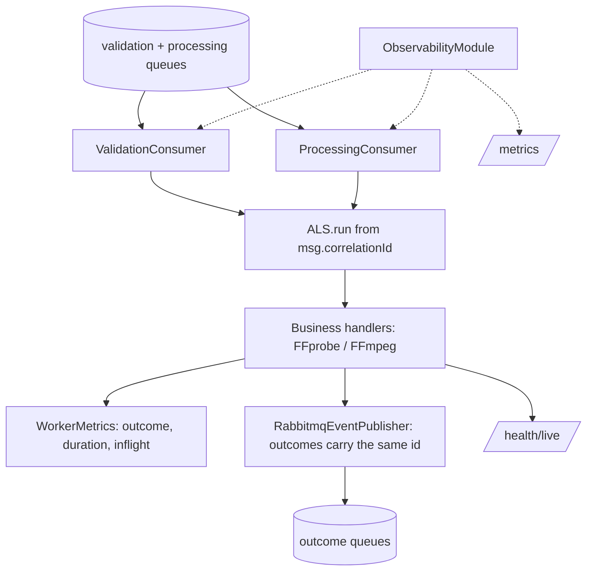

# Observability Design — Processing Worker

**Spec**: `.specs/features/observability/spec.md` (OBS-31..45)
**Status**: Draft

---

## Architecture Overview

Same `ObservabilityModule` spine (nestjs-pino + ALS `CorrelationContext` + dedicated prom-client registry). The Worker is pure propagation and measurement: both `@EventPattern` consumers open the ALS scope from the consumed message's `correlationId` (strict parse, generate-on-absent), the outcome publisher copies the context id onto the emitted DTO, and the two consumers own the metric hooks — outcome counters, the duration histogram, and the in-flight gauge released in a `finally`.



---

## Code Reuse Analysis

### Existing Components to Leverage

| Component | Location | How to Use |
| --- | --- | --- |
| Per-queue prefetch | `src/messaging/consumer-options.ts` (`PREFETCH_VALIDATION`/`PREFETCH_PROCESSING`) | Unchanged — AD-006 model is observed, not touched |
| Outcome publisher | `src/messaging/rabbitmq-event-publisher.ts` | Gains `correlationId` on every emitted DTO (taken from the ALS context) |
| Settle logic | `src/messaging/settle-failed-message.ts` | Unchanged retry/DLQ semantics (AD-012) |
| Shutdown-aware consumer | `src/processing/processing.consumer.ts` | In-flight gauge decremented in the same `finally` that settles the message; shutdown flag behavior untouched |
| Health controller | `src/health/health.controller.ts` (readiness + `/live`) | Rename `live` → `health/live`; readiness body unchanged |
| Health service | `src/messaging/rabbitmq-health.service.ts`, ffmpeg indicator | Reused unchanged |

### Integration Points

| System | Integration Method |
| --- | --- |
| processing-catalog | Consumes `{pattern, data}` where `data` gains optional `correlationId`; publishes outcomes with the same field. No exchange/queue change (sendToQueue-by-name topology per AD-011) |
| Prometheus (platform) | Scrapes `GET /metrics` on port 3002; **dns-based service discovery** (`dns_sd_configs`, type A, port 3002) so every `WORKER_REPLICAS` replica is scraped — a static `worker:3002` target would hit only one container |
| Compose healthcheck | Probes `/health` (readiness); unchanged |

---

## Components

### Consumer correlation wrapper

- **Purpose**: OBS-31/34 — set the log context from the consumed message.
- **Location**: `src/messaging/with-correlation.ts`; applied in `src/validation/validation.consumer.ts` and `src/processing/processing.consumer.ts`
- **Interfaces**: `const id = parseCorrelationId(data?.correlationId) ?? randomUUID(); await runWithCorrelation(id, () => this.handle(data, ctx))`; strict parse — numbers/objects are replaced, never coerced to `"null"` (L-010); absent/invalid never fails the message.
- **Dependencies**: CorrelationContext
- **Reuses**: identical helper shape as the Catalog's (copied per repo)

### Outcome DTO + publisher changes

- **Purpose**: OBS-32/33 — republished events carry the same id.
- **Location**: `src/messaging/dto/*.ts`, `src/messaging/rabbitmq-event-publisher.ts`
- **Interfaces**: all five outcome DTOs gain `correlationId?: string`; the publisher reads `getCorrelationId()` at emit time and sets the field (omitted when undefined).
- **Reuses**: existing `client.emit()` flow; no confirm/delivery change

### WorkerMetrics

- **Purpose**: OBS-37..40.
- **Location**: `src/observability/metrics.ts` + `metrics.controller.ts`
- **Interfaces**:
  - `recordValidation(outcome: 'accepted'|'rejected')` -> `fiapx_validation_total`
  - `recordProcessing(outcome: 'completed'|'failed', durationSeconds: number)` -> `fiapx_processing_total` + `fiapx_processing_duration_seconds.observe`
  - `inflight(queue: 'validation'|'processing'): { track<T>(fn: () => Promise<T>): Promise<T> }` — gauge +1 before, −1 in `finally` (success, throw, and shutdown-left-for-redelivery alike)
  - HTTP counters for `/health`/`/metrics` traffic (`fiapx_http_requests_total`), `resetMetrics()`
- **Dependencies**: `prom-client`
- **Reuses**: `inflight.track()` wraps the existing handler bodies without altering their logic

### Health split

- **Purpose**: OBS-41/42.
- **Location**: `src/health/health.controller.ts`
- **Interfaces**: `GET /health` readiness unchanged (503 + dependency body when down); `GET /health/live` (renamed from `live`, all in-repo references updated) -> 200 while serving. Both unauthenticated (no guard exists).
- **Reuses**: existing indicators (rabbitmq, ffmpeg, storage)

### Pino root config

- **Purpose**: OBS-35/36 — JSON logs, correlation id, no storage keys.
- **Location**: `src/observability/logger.config.ts`
- **Interfaces**: ALS mixin; `redact` covers `*.sourceStorageKey`, `*.zipStorageKey`, `*.url` (defensive), plus the shared auth/email paths; storage keys continue to never be logged at any level, message strings included — `test/observability.e2e-spec.ts` guards this on the Worker's own logger wiring (post-verification F1/F2).
- **Reuses**: nestjs-pino

---

## Data Models

```typescript
// consumed DTOs gain (all five events published, two consumed families)
correlationId?: string;

// metric families (bounded labels only)
fiapx_validation_total{outcome}
fiapx_processing_total{outcome}
fiapx_processing_duration_seconds // histogram, label-free
fiapx_jobs_inflight{queue}
```

---

## Error Handling Strategy

| Error Scenario | Handling | User Impact |
| --- | --- | --- |
| Handler throws before publishing | inflight −1 in `finally`, settlement counter/behavior unchanged | Existing retry/DLQ semantics preserved |
| `correlationId` absent/invalid in message | Generated id; outcomes carry the generated id | Chain continues with a fresh root |
| Metrics throw during collection | Registry reads are inert; middleware try/catch | Never reaches the handler |
| Broker down at runtime | Readiness 503 via existing indicator; liveness 200 | Platform sees not-ready |

---

## Risks & Concerns

| Concern | Location (file:line) | Impact | Mitigation |
| --- | --- | --- | --- |
| In-flight gauge leak if a handler never settles | consumers | Dashboard shows phantom load | `finally`-based release; L-009 applied — a test asserts the gauge returns to 0 after a throwing handler, not only that concurrent handlers are excluded |
| `WORKER_REPLICAS>1` metrics invisible to a static target | platform scrape config | Under-counted processing rate | `dns_sd_configs` for the worker (decided with the platform design) |
| `@nestjs/microservices` ack happens after our wrapper returns | consumer ctx | Context cleared too early? | ALS scope covers the whole handler including the settle call; clearing on scope exit is safe because settlement completes first |
| Renaming `/live` breaks external references | `src/health/health.controller.ts:57` | Compose/other scripts probing `/live` fail | In-repo grep for `/live` in tasks; compose probes `/health` already |
| pino e2e noise against the broker suite | `test/broker.e2e-spec.ts` et al. | Noisy CI | `LOG_LEVEL=fatal` in e2e bootstrap |

---

## Tech Decisions (only non-obvious ones)

| Decision | Choice | Rationale |
| --- | --- | --- |
| Publisher reads the id from ALS at emit time, not a passed parameter | fewer call-site changes, cannot be forgotten per event | The context is opened by the consumer wrapper; every emit inside inherits it |
| Duration measured handler-start → settle (incl. publish) | matches the operator question "how long does a job take end-to-end" | Excludes broker wait time (that is queue age, owned by RabbitMQ metrics) |
| No `fiapx_events_consumed_total` here | outcome counters subsume it | One counter per fact; the Catalog keeps the consumed lens |
| Exact package versions | pinned at task time via npm | avoids fabricated versions |
