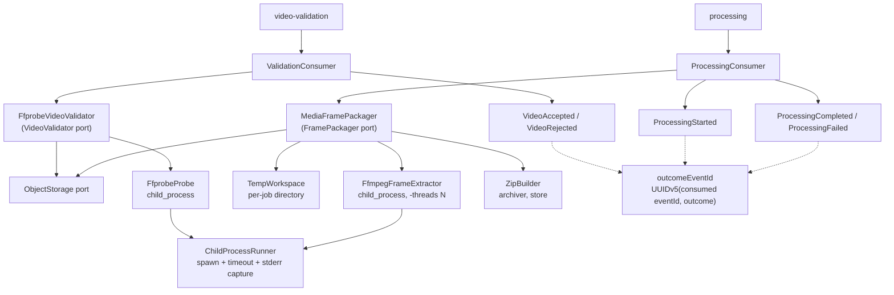

# Real Media Processing Design — worker

**Spec**: `.specs/features/real-media-processing/spec.md`
**Status**: Draft

---

## Project decisions this design conforms to

Read from `.specs/STATE.md` `## Decisions`. Every `active` entry is a constraint here.

| Decision | How this design conforms |
| --- | --- |
| **AD-001** — four services separated by responsibility | This service produces media and publishes facts. It does not decide lifecycle status and does not read another service's tables |
| **AD-005** — local-first, protocol-level ports | Object storage is reached through the S3 API, so MinIO and any managed equivalent are the same adapter with a different endpoint. No provider name appears above the adapter |
| **AD-006** — NestJS Worker, `child_process`, `prefetch`, explicit `ffmpeg -threads`, no `worker_threads` | FFprobe and FFmpeg run as child processes. `prefetchCount` is configured per queue. `-threads` comes from configuration, never from host detection. No `worker_threads` anywhere |
| **AD-008** — no cache tier | Idempotency is decided by the existence of the object at the deterministic key, not by a cache |

**Decisions recorded by S3.** This branch was rebased onto `main` after `durable-persistence` merged (2026-09-24), so `AD-009` (TypeORM), `AD-010` (only the outbox publishes) and `AD-011` (shared broker topology is a broker policy) are now in the log. Two of them constrain this design:

- **AD-010** makes delivery at-least-once, which is why P4 (redelivery costs nothing) exists at all rather than being defensive programming.
- **AD-011** forbids setting queue arguments in a service. Task T15 changes `prefetchCount`, which is a **consumer** setting carried on the channel, not a queue argument — so it does not touch the topology the policy owns. `broker-topology.spec.ts` in this repository keeps that boundary enforced.

**No new project-level decision is proposed.** Everything below is either an application of AD-006 or feature-local.

---

## Approaches considered

The one genuinely architectural choice is where the bytes live while a job runs.

| Approach | How it works | Why not / why yes |
| --- | --- | --- |
| **Disk-staged (chosen)** | Download the source to a per-job temp directory, probe it, extract frames beside it, build the archive from those files, upload the archive, remove the directory | FFprobe and FFmpeg both seek; they are built to read files. The 500 MB ceiling makes the disk cost bounded and known. Failure handling is one `rm -rf` of a directory whose name says who owns it |
| Fully streamed | Stream the source from storage into FFmpeg's stdin, pipe frames into an archiver, multipart-upload the archive as it forms | Removes the disk ceiling, and looks elegant. But FFmpeg reading MP4 from a pipe cannot seek, so `moov`-at-end files fail and duration is unreliable — the exact property validation depends on. It also makes a mid-stream failure produce a partially uploaded object, which P2's "exactly one archive at the key" then has to undo |
| Hybrid: stream the probe, stage the extraction | Ranged reads for the probe, download only if accepted | Saves transferring a file that will be rejected. But rejection is already cheap: RM-07 checks the **reported size** before downloading, so the only wasted transfers are files that are small and invalid. The saving is small and the second I/O path doubles the failure surface |

Disk-staging is the recommendation. The streamed variant is worth revisiting only if the 500 MB ceiling rises far enough that disk becomes the binding constraint — at which point `moov` placement must be handled deliberately rather than discovered.

---

## Architecture Overview

Two consumers, each replacing one stub with a real implementation behind the port that already exists. Nothing above the ports changes: `validation.consumer.ts` and `processing.consumer.ts` keep their current shape, which is why the events, the DTOs and the routing all stay untouched.



The queue names are the ones the Catalog's `event-routes.ts` publishes to (`video-validation`, `processing`), not the event names. The distinction matters outside this repository: the broker's dead-letter policy currently matches the event names, so it covers neither queue (gap analysis V2).

The two child-process users share one runner. That is deliberate: the timeout, the non-zero-exit handling and the stderr capture are the parts most likely to be got subtly wrong, and having two copies means fixing each bug twice.

---

## Code Reuse Analysis

### Existing Components to Leverage

| Component | Location | How to Use |
| --- | --- | --- |
| `VideoValidator` port and `FailureCode` | `src/validation/video-validator.interface.ts` | Implement as-is. The closed code vocabulary is already defined here and the Catalog rejects anything outside it |
| `FramePackager` port | `src/processing/frame-packager.interface.ts` | Implement as-is. Its contract is already "return the storage key", which is exactly what the real implementation returns |
| `AcceptAllVideoValidator` | `src/validation/accept-all-video-validator.ts` | Keep as the test double. Its own header says it exists to be replaced; deleting it would remove the only fast validator the unit tests can use |
| `DeterministicFramePackager` | `src/processing/deterministic-frame-packager.ts` | Keep as the test double, and keep its key derivation — the real packager must produce the **same** key, so this file becomes the single definition of the key format |
| `ValidationConsumer` / `ProcessingConsumer` | `src/validation/validation.consumer.ts`, `src/processing/processing.consumer.ts` | Unchanged. Both already publish the right events for both outcomes |
| `InMemoryDuplicateChecker` | `src/validation/in-memory-duplicate-checker.ts` | Unchanged, and knowingly volatile. It is not what makes a redelivery safe: RM-13 (object at the key) makes the work idempotent, and RM-18 (derived `eventId`) makes the republished event idempotent at the Catalog, which dedups durably |
| Outcome `eventId` generation | `randomUUID()` in `src/validation/validation.consumer.ts` and `src/processing/processing.consumer.ts` | Replaced by `outcomeEventId` (below). This is the one change to the consumers' publication paths |
| Module wiring pattern | `src/messaging/messaging.module.ts` | The token-plus-factory shape it uses for clients is the shape the storage adapter selection follows |
| `broker-topology.spec.ts` | `src/messaging/broker-topology.spec.ts` | Leave it passing. It is what keeps T15's prefetch change from drifting into a queue-argument change |

### Integration Points

| System | Integration Method |
| --- | --- |
| Object storage (MinIO locally) | S3 API through `@aws-sdk/client-s3`, with `forcePathStyle: true` and an endpoint from configuration |
| RabbitMQ | Unchanged transport and routing. Only `prefetchCount` is added, on the consumer side |
| Catalog | Unchanged events. `ProcessingCompleted.zipStorageKey` now names an object that exists |
| `fiap-x-platform` | Provides the bucket, its retention, the seeded source object and the smoke that reads the produced archive (RM-01 to RM-06) |

---

## Components

### ChildProcessRunner

- **Purpose**: Runs one external command to completion with a timeout, returning its stdout or a typed failure carrying stderr.
- **Location**: `src/media/child-process.runner.ts`
- **Interfaces**:
  - `run(command: string, args: string[], options: RunOptions): Promise<RunResult>` - resolves with `{ stdout, stderr }` on exit code 0
- **Dependencies**: `node:child_process`
- **Reuses**: Nothing. This is the one genuinely new primitive.
- **Notes**: Uses `spawn`, never `exec` - `exec` buffers through a shell, which turns a filename into an injection surface and a large stderr into a truncation bug. On timeout it sends `SIGKILL` after `SIGTERM` and reports the timeout as the cause, because a hung FFmpeg that ignores `SIGTERM` must not hold the job forever.

### FfprobeProbe

- **Purpose**: Reports what FFprobe can determine about a local file.
- **Location**: `src/media/ffprobe-probe.ts`
- **Interfaces**:
  - `probe(path: string): Promise<ProbeResult>` - `{ readable: false }` when FFprobe fails or times out
- **Dependencies**: `ChildProcessRunner`
- **Reuses**: `ChildProcessRunner`
- **Notes**: Invokes `ffprobe -v error -print_format json -show_format -show_streams <path>` and reads `format.format_name`, `format.duration` and `streams[].codec_type`. A file with an MP4 container and no `video` stream is **not** readable for our purposes - that distinction is the reason this returns a structured result rather than a duration.

### FfprobeVideoValidator

- **Purpose**: Decides acceptance from a probe and the object's size, mapping every rejection to a safe code.
- **Location**: `src/validation/ffprobe-video-validator.ts`
- **Interfaces**:
  - `validate(job: VideoValidationRequestedDto): Promise<ValidationOutcome>`
- **Dependencies**: `ObjectStorage`, `FfprobeProbe`, `TempWorkspace`
- **Reuses**: `VideoValidator` port, `FailureCode` union
- **Notes**: Order matters and is part of the contract: **size first** (from `head`, no transfer), then download, then probe. Duration is checked before container family only because a long valid video is the more informative rejection.

### ObjectStorage port and adapters

- **Purpose**: Reads and writes objects by key without naming a provider.
- **Location**: `src/storage/object-storage.interface.ts`, `src/storage/s3-object-storage.ts`, `src/storage/in-memory-object-storage.ts`
- **Interfaces**:
  - `head(key: string): Promise<ObjectHead | undefined>` - `undefined` when absent; never throws for absence
  - `download(key: string, destinationPath: string): Promise<void>`
  - `upload(key: string, sourcePath: string, contentType: string): Promise<void>`
- **Dependencies**: `@aws-sdk/client-s3` (adapter only)
- **Reuses**: The token-and-factory selection pattern from `messaging.module.ts`
- **Notes**: Absence is a return value, not an exception, because absence is an expected outcome twice over - a missing source is a rejection (RM-07) and a missing archive is the normal case for a first attempt (RM-13). Making it an exception would put control flow in a catch block.

### TempWorkspace

- **Purpose**: Owns a per-job directory and guarantees its removal.
- **Location**: `src/media/temp-workspace.ts`
- **Interfaces**:
  - `withWorkspace<T>(jobId: string, work: (dir: string) => Promise<T>): Promise<T>`
- **Dependencies**: `node:fs/promises`, `node:os`
- **Reuses**: The `runInTransaction` shape from the Catalog's unit of work - the resource is handed **to** the callback rather than acquired by it, so no path out can skip the release.
- **Notes**: The callback form is the whole point. A `create()`/`destroy()` pair puts cleanup at every call site, and RM-16 requires cleanup on paths that include a thrown timeout.

### FfmpegFrameExtractor

- **Purpose**: Writes one JPEG per second of video into a directory.
- **Location**: `src/media/ffmpeg-frame-extractor.ts`
- **Interfaces**:
  - `extract(sourcePath: string, destinationDir: string): Promise<string[]>` - the frame paths, in temporal order
- **Dependencies**: `ChildProcessRunner`, configuration for the thread count
- **Reuses**: `ChildProcessRunner`
- **Notes**: `ffmpeg -nostdin -v error -i <src> -vf fps=1 -threads <N> <dir>/frame-%05d.jpg`. `-nostdin` matters: without it FFmpeg can consume the parent's stdin and interfere with a container's signal handling. The returned list is read back from the directory and sorted, so the archive's contents are derived from what FFmpeg actually wrote rather than from what we expected it to write.

### ZipBuilder

- **Purpose**: Packs files into one uncompressed archive.
- **Location**: `src/media/zip-builder.ts`
- **Interfaces**:
  - `build(files: string[], destinationPath: string): Promise<number>` - resolves with the entry count written
- **Dependencies**: `archiver` v8
- **Reuses**: Nothing
- **Notes**: Created with `{ zlib: { level: 0 } }` - JPEG does not compress, so any level above zero spends CPU for nothing. Resolving with the entry count lets the packager assert that what went in came out, rather than trusting the library.

### MediaFramePackager

- **Purpose**: Turns a queued job into exactly one stored archive, idempotently.
- **Location**: `src/processing/media-frame-packager.ts`
- **Interfaces**:
  - `packageFrames(job: ProcessingQueuedDto): Promise<string>`
- **Dependencies**: `ObjectStorage`, `FfmpegFrameExtractor`, `ZipBuilder`, `TempWorkspace`
- **Reuses**: `FramePackager` port; the key derivation from `DeterministicFramePackager`
- **Notes**: Begins with `head(key)`. If the archive is already there it returns the key without extracting - that single check is all of RM-13, and it works across restarts and replicas because storage is the shared state. The upload is the last step, so a failure anywhere earlier leaves no object at all rather than a partial one.

### outcomeEventId

- **Purpose**: Gives every outcome event an `eventId` that a redelivery of the same job reproduces.
- **Location**: `src/messaging/outcome-event-id.ts`
- **Interfaces**:
  - `outcomeEventId(consumedEventId: string, outcome: OutcomeType): string` - a UUIDv5 under a fixed namespace constant, over `<consumedEventId>:<outcome>`
- **Dependencies**: `node:crypto` (SHA-1, formatted as a v5 UUID) - no new package
- **Reuses**: Nothing
- **Notes**: Keyed on the **consumed** event's id, not on `processingRequestId`, so a genuinely new attempt (a new `ProcessingQueued` with a new id) still gets new outcome ids, while a technical redelivery of the same message gets the same ones. `ProcessingStarted` and `ProcessingCompleted` for one job differ by `outcome`, so they never collide. The Catalog stores `processed_event.event_id` as `text`, so any stable string would work; a v5 UUID keeps the shape every other event already has, which is what logs and contract tests assume.

### FfmpegAvailability check

- **Purpose**: Fails readiness at startup when the binaries are missing.
- **Location**: `src/health/ffmpeg-availability.indicator.ts`
- **Interfaces**:
  - `isHealthy(): Promise<boolean>`
- **Dependencies**: `ChildProcessRunner`
- **Reuses**: The health indicator shape in `src/health/`
- **Notes**: Probed once at bootstrap and cached. An image without FFmpeg would otherwise fail every job individually and look like a media problem rather than a packaging problem.

---

## Data Models

```typescript
export interface ProbeResult {
  readable: boolean
  formatNames: string[]     // `format.format_name` split on ','
  durationSeconds?: number  // absent when FFprobe reports none
  hasVideoStream: boolean
}

export interface ObjectHead {
  sizeBytes: number
  contentType?: string
}

export interface RunOptions {
  timeoutMs: number
  cwd?: string
}

export interface RunResult {
  stdout: string
  stderr: string
}
```

**Relationships**: `ProbeResult` is consumed only by `FfprobeVideoValidator`; it deliberately does not model codecs or bitrates, because no requirement reads them.

### Configuration

| Variable | Default | Requirement |
| --- | --- | --- |
| `STORAGE_ENDPOINT` | `http://minio:9000` | RM-09 |
| `STORAGE_BUCKET` | `fiapx` | RM-11 |
| `STORAGE_ACCESS_KEY` / `STORAGE_SECRET_KEY` | none - absent means the in-memory adapter | RM-09 |
| `FFMPEG_THREADS` | `1` | RM-15 |
| `FFMPEG_TIMEOUT_MS` | `600000` | edge case: hung extraction |
| `FFPROBE_TIMEOUT_MS` | `30000` | RM-07 probe timeout |
| `PREFETCH_VALIDATION` | `20` | RM-14 |
| `PREFETCH_PROCESSING` | `1` | RM-14 |
| `MAX_SOURCE_BYTES` | `524288000` | RM-07 |
| `MAX_DURATION_SECONDS` | `600` | RM-07 |

Absent storage credentials selecting the in-memory adapter mirrors the Catalog's `DATABASE_HOST` switch - **and inherits its hazard.** That is exactly how the Catalog shipped a complete persistence layer that nothing referenced. The mitigation is in Risks below and is a task, not a note.

---

## Error Handling Strategy

| Error Scenario | Handling | User Impact |
| --- | --- | --- |
| Source object absent | `head` returns `undefined`; validator rejects with `FORMATO_INVALIDO` | Request reaches `FAILED` with a safe reason immediately |
| Source over 500 MB | Rejected from the `head` size, before any transfer | Same, and no bandwidth spent |
| Duration over 600 s | Rejected with `DURACAO_EXCEDIDA` | `FAILED`, reason names the duration rule |
| FFprobe non-zero or timeout | `{ readable: false }`; rejected with `FORMATO_INVALIDO` | `FAILED` rather than an infinite requeue against a file that will never parse |
| FFmpeg non-zero or timeout | Packager throws; consumer publishes `ProcessingFailed` with `PROCESSAMENTO_FALHOU`; workspace removed | `FAILED`, no partial archive stored |
| Storage unreachable on download or upload | Same as above | `FAILED` rather than a silently unacknowledged job |
| Archive already at the key | `head` hit; key returned without extracting; `ProcessingCompleted` republished under the same derived `eventId` | Redelivery is invisible; no second object, and the Catalog absorbs the duplicate instead of dead-lettering it |
| Storage unreachable during validation | Nack with requeue; no `VideoRejected` | None beyond delay. Rejecting would blame the user's file for our outage |
| Workspace removal fails | Path logged; the published outcome is not changed | None. The outcome was already correct; a leaked directory is an operator concern, not a user one |
| FFmpeg absent from the image | Readiness false at startup | The pod never receives traffic, instead of failing every job |

---

## Risks & Concerns

| Concern | Location (file:line) | Impact | Mitigation |
| --- | --- | --- | --- |
| **The in-memory adapter can be selected silently in a real deployment** — the same shape that let the Catalog run with zero tables while 36 tests passed | `src/app.module.ts` (new wiring) | The Worker would report healthy, accept jobs, and produce archives nobody can read | T7 adds a composition test asserting which adapter the root selects with and without credentials, and the readiness check reports the storage adapter in use. Not a comment - a task |
| `AcceptAllVideoValidator` remains in the tree after the real one exists | `src/validation/accept-all-video-validator.ts:13` | A future wiring mistake could select it, and everything would pass | It stays only as a test double and is never registered by the production factory; the composition tests in T10 and T14 assert the real validator and packager are the ones selected |
| Existing tests cannot type-check themselves | `package.json` (`ts-jest`) | Three S2 defects passed `npm test` and were caught only by `npm run build` | `npm run typecheck` already exists and is in the CI gate. Every task here uses the full gate, which includes it |
| No test currently exercises a real child process | — | A `spawn` misuse (shell quoting, unhandled stderr, timeout that never fires) would surface only in a container | `ChildProcessRunner` is tested against real short-lived commands (`true`, `false`, a sleep that outlives its timeout), not against a mocked `child_process` |
| `-threads` correctness cannot be observed from inside the process | `src/media/ffmpeg-frame-extractor.ts` | The flag could be dropped and every functional test would still pass | The extractor is tested by asserting the **argument vector** it builds, in addition to the frames it produces. RM-05 in the platform then checks the value against the container's CPU limit |
| Temp directory leakage is invisible to unit tests that stub the filesystem | `src/media/temp-workspace.ts` | Disk fills in production, not in CI | `TempWorkspace` is tested against the real filesystem, asserting the directory is gone after both a returning and a throwing callback |
| A 500 MB source plus its frames can exceed the container's disk | — | Extraction fails with a confusing `ENOSPC` | Treated as a failure path (`PROCESSAMENTO_FALHOU`) with cleanup, and listed as an edge case in the spec. Sizing the volume is S9a's concern |

---

## Tech Decisions (only non-obvious ones)

| Decision | Choice | Rationale |
| --- | --- | --- |
| Where bytes live during a job | Disk-staged per-job directory | FFprobe and FFmpeg seek; a pipe breaks `moov`-at-end MP4s and makes duration unreliable. See Approaches considered |
| `spawn` vs `exec` | `spawn` with an argument vector | `exec` goes through a shell, making a storage key with a quote in it an injection surface |
| Resource handling for temp files | Callback-scoped `withWorkspace` | The same reason the Catalog's unit of work hands the repository to the callback: no exit path can skip the release |
| Idempotency source of truth | Existence of the object at the deterministic key | Survives restart and is shared across replicas. Local state satisfies neither, and AD-008 rules out a cache |
| Outcome `eventId` | UUIDv5 of the consumed `eventId` and the outcome type | Moves event-level idempotency to the Catalog's durable `processed_event` table instead of adding a store here. Random ids made every redelivery look like a new event and dead-letter at the Catalog |
| Absence as a return value, not an exception | `head` returns `undefined` | Absence is an expected outcome in two requirements; exceptions would make it control flow in a catch |
| ZIP compression level | `0` (store) | JPEG does not compress. Any level above zero is CPU spent for nothing |
| Frame naming | `frame-%05d.jpg` | Zero padding makes lexical order equal to temporal order, which RM-11 requires and a consumer will assume |
| Testing the thread count | Assert the argument vector, not only the output | The flag's absence is invisible in the produced frames, which is precisely why AD-006 had to state it |
| Keeping the stub implementations | Retained as test doubles, never registered in production | They make unit tests fast, and their file headers already document them as stand-ins |
